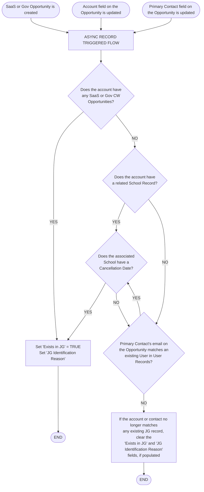

# JG Account Check Documentation
## Business Process Solution Overview
We’ve created a process that flags open opportunities where the account or user associated with it might already exist in Jungle Gym. This is meant to help reps take the proper steps when CW’ing an opportunity, depending on the outcome. It will helps us:
Avoid duplicates
Track returning customers
Identify existing relationships
When the automation runs, it evaluates whether a given Opportunity record is associated with any existing entities in Jungle Gym.

The first check the automation performs is to look for previously Closed Won Opportunities under the same Opportunity’s Account, limited to the record types “SaaS” or “Government Licensee.” If one is found, the automation sets the field Exists in JG to true and populates the JG Identification Reason field with the value “Account Has Previous CW Opportunity.”

The second check involves identifying whether the Account is related to a School record that has the Cancellation Date field populated. If so, the automation considers that a match and flags the Opportunity with the reason “Previous Premium School.”

Lastly, the automation checks if the primary Contact associated with the Opportunity is a JG user match. It compares the email and secondary email fields of the Contact to user records in Jungle Gym. If a match is found, the automation sets Exists in JG to true and populates the JG Identification Reason field with a label such as “Contact already in JG as Admin” or a similar value. Here are the possible values when a contact is matched:

Contact already in JG as Admin
Contact already in JG as Admin (No Billing)
Contact already in JG as Billing Only
Contact already in JG as Guardian
Contact already in JG as Lead Teacher
Contact already in JG as Org Reporter
Contact already in JG as Super Admin
Contact already in JG as Teacher
Contact already in JG as Teacher (No Messaging)
Contact already in JG with Undefined Role
If none of the above conditions are true, but the Opportunity had previously been flagged as related to JG, the automation clears that flag and resets the JG Identification Reason field. This ensures that the flag is always accurate and reflects current data.Here’s what will trigger the opportunity evaluation to run:A User Object record’s email is updated: If the email is changed, the system looks for a matching Contact. If a match is found and that Contact is associated with any open SaaS or Government Licensee Opportunities, the automation loops through those open opportunities and runs the evaluation for each one of them.A Contact’s email or secondary email is updated: The automation checks if the Contact is tied to any open Opportunities. If a match is found and that Contact is associated with any open SaaS or Government Licensee Opportunities, the automation loops through those open opportunities and runs the evaluation for each one of them.
An Opportunity’s Contact or Account is updated: When either of those fields change and the Opportunity is still open, the automation is triggered directly using that updated Opportunity.

In short, the automation runs again whenever any of the following fields are changed:

Email or Email 2 on a Contact
Email on a User Object
Contact or Account on an Opportunity

## Technical Process Solution Overview
These flows interact by triggering the Opportunity - Subflow - JG Account Check, which performs all logic to flag the Opportunity with Exists in JG and JG Identification fields.

(NEW) Opportunity - Subflow - JG Account Check (Subflow)
Type: Auto-Launched Flow
Purpose: Central logic to evaluate and flag an Opportunity based on JG existence
(NEW)  User Object - Record Triggered - Email Update &amp; JG Account Check
Type: Auto-Launched Record-Triggered (After Save, Async)
Object: User Object
Runs When
Email is changed and not null
Logic:
Finds a matching Contact using the updated email
Looks for open SaaS/Gov Opportunities tied to that Contact
Loops through each Opportunity
Calls subflow Opportunity - Subflow - JG Account Check
(NEW)  Opportunity - Record Triggered - JG Account Flag
Type: Auto-Launched Record-Triggered (After Save, Async))
Object: Opportunity
Runs When:
IsClosed = false
Record Type = SaaS or Government Licensee
Account or Contact (not is null) is changed
Logic:
Calls subflow Opportunity - Subflow - JG Account Check
(NEW)  Contact - After Save - JG Account Flag
Type: Record-Triggered (After Save, Async)
Object: Contact
Runs When:
Email or Email 2 changed AND is not null
Logic:
Finds most recent open SaaS/Gov Opportunity tied to this Contact

Fields
Opportunity Object
(NEW) Exists In JG
(NEW) JG Identification Reason

## Flow Diagram — Flagging Existing JG Accounts on SaaS & Gov Opportunities

### Net New Fields (from diagram)

| Field | Type | Editable By | Notes |
|-------|------|-------------|-------|
| Exists in JG | Checkbox | Admins only | Defaults to unchecked. Visible to all profiles. |
| JG Identification Reason | Picklist | Admins only | Visible to all profiles. Values: Account Has Previous CW Opportunity, Previous Premium School, Contact Already in JG. |
